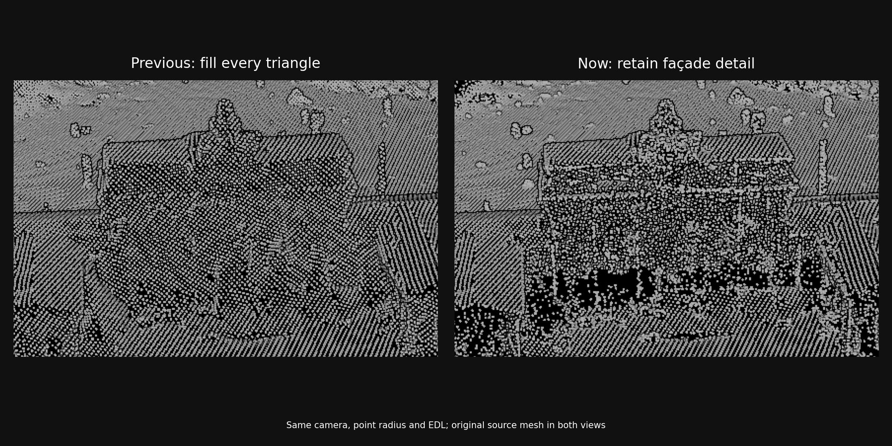

# Preserve façade detail without filling apparent passages

The default converter sampling mode is now `detail`. All 63 local tiles were rebuilt and installed with this mode, and the native viewer was restarted with the six-tile default collection.



## Diagnosis

Full surface sampling made source-mesh closures much more visible. In the supplied `zips3/Tile-106-69-1-1.zip`, triangles span the apparent central passage region. This is not a shader generating walls between points: the converter sampled the interiors of those existing triangles. Original vertex density represented columns more strongly than the closure surfaces.

An independent local-coordinate inspection used the corrected, source-order vertices in `target/alignment/rebuild/hypc/fixed/Tile-106-69-1-1.hypc` and the original OBJ faces. The local ENU origin is latitude 52.516275°, longitude 13.3777°, ellipsoidal height 0 m [A1]. A ray parallel to east, at north 0 m and local up 40 m, intersects gate-region triangles at east −4.29046 m and +3.50273 m. Rays at up 38 m and 42 m also intersect two surfaces. These are numerical source-mesh observations, not measurements of the physical monument. Detailed ray results remain in `target/detail/passage-rays.json`.

## Algorithm and scope

For each nondegenerate source triangle, compute its ECEF normal `n` and the ellipsoidal unit-up vector `u` at its centroid. With a configurable slope threshold θ = 30° = π/6 rad:

```text
if (n · u)² < (n · n) cos²(θ):
    retain the triangle's original vertices
else:
    sample its interior on the shared 0.5 m ECEF lattice
quantize, sort and deduplicate the resulting points
```

Squaring makes classification independent of winding. Both sides of the inequality have units m⁴. No coordinates are displaced to create an opening. This policy retains detailed steep surfaces while supplying regular coverage on shallow ground and roofs [A2]. Degenerate triangles are skipped, as in surface mode; unreferenced vertices are available through `--sampling vertices`.

Time is O(F + C + V + S log S), with F triangles, C tested lattice cells, V source vertices and S output candidates. Auxiliary/output space is O(V + S), excluding the input mesh. The original full-surface behavior remains available with `--sampling surface`.

## Verification

Fourteen converter tests passed: 13 unit tests and one CLI integration test. New regression tests verify that steep closure triangles are not densified, sub-spacing façade vertices survive, winding does not affect the result, invalid slope settings fail, and flat tile cuts preserve the shared lattice.

All 63 files passed independent source-coordinate and point-to-triangle checks. The latter inspected 258,048 samples; maximum distance was 1.45 mm, within the applicable combined quantization bounds (maximum 1.73 mm). These checks establish conversion consistency, not source survey accuracy [A1]. All installed SHA-256 hashes and `Detail` provenance were verified against `target/alignment/rebuild/detail-manifest.json`.

| Collection | Tiles | Installed points | Shared semantic-cell comparisons | Disagreements |
|---|---:|---:|---:|---:|
| hypc | 6 | 5,033,907 | 3,880 | 0 |
| hypc2 | 49 | 41,409,282 | 46,904 | 0 |
| hypcx | 8 | 7,239,435 | 6,511 | 0 |
| Total | 63 | 53,682,624 | 57,295 | 0 |

The gate comparison uses identical camera, EDL and point radius: target (52.516275°, 13.3777°, 45 m), orbit radius 180 m, elevation 25°, azimuth 90°, point radius 1.33 pixels. It shows clearer passage-region contrast with detail sampling. The other two collections were also rendered and inspected using the production pipeline [A3].

Rebuild:

```sh
cargo build --release --manifest-path crates/obj2hypc/Cargo.toml
python3 scripts/rebuild_berlin_tiles.py \
  --dataset hypc --dataset hypc2 --dataset hypcx \
  --sources zips3 --sources zips2 --sources ../files/berlin_tiles \
  --feature-index crates/obj2hypc/mesh-index-2023.json \
  --osm-pbf crates/obj2hypc/berlin-2025-08-24.osm.pbf \
  --sampling detail --detail-max-fill-slope-deg 30 --install
```

Staged detail files and audits are under `target/alignment/rebuild/<collection>/detail*`. Prior surface files remain under `surface/`, and original backups remain under `original/`. Preserve these directories before `cargo clean`.

## Assumptions and bounded findings

| ID | Assumption | Stress test / falsification probe | Dependent result |
|---|---|---|---|
| A1 | EPSG:25833 horizontal coordinates and unchanged source heights identify the supplied mesh. Absolute vertical datum remains **unknown**. | Independent coordinate controls; surveyed/geoid controls would test absolute placement. | Ray coordinates and source fidelity, not physical passage topology. |
| A2 | Original steep-surface vertex density carries useful detail contrast; 30° is a visualization parameter. | Compare identical-camera captures and vary `--detail-max-fill-slope-deg`. | Improved detail appearance. This is not a universal reconstruction rule. |
| A3 | The inspected Metal captures represent the stated camera cases. | Repeat at other viewpoints and backends. | Visual evidence; appearance remains view-dependent. |

**High impact:** source triangles may close real openings; a denser surface sample cannot recover absent topology. **Medium impact:** original-vertex density can vary on steep surfaces, including at source tile cuts; flat-surface lattice invariance is retained. Point count rises by 8.16% across all collections relative to full-surface sampling (10.96% in the default collection). **Low impact:** the sampling mode is recorded in each tile's provenance, making future comparisons attributable.

Quality gates: technical content only (QG1); assumptions and probes stated (QG2); implementation, installed assets and visual checks covered (QG3); units and numerical bounds stated (QG4); physical topology separated from visualization behavior (QG5); primary local OBJ/HYPC data, tests, hashes and captures provide provenance (QG6); bounded findings above (QG7).
